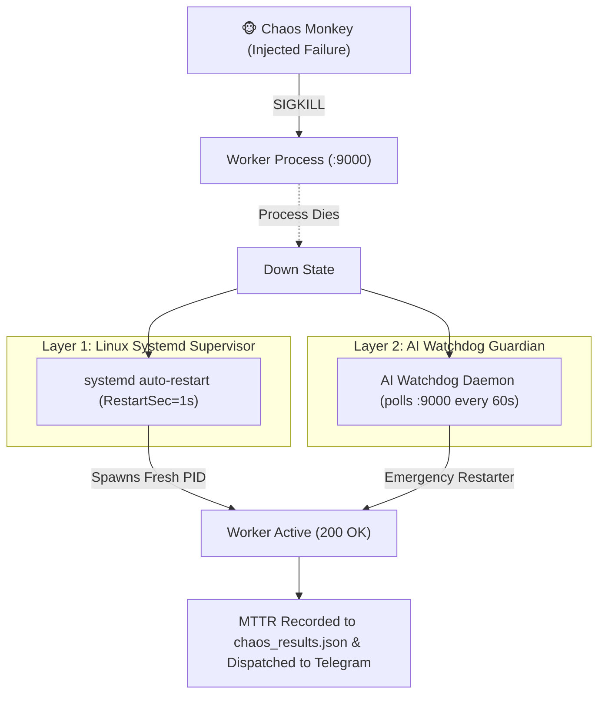

# Genie Autonomous Systems: Chaos Engineering & Resiliency Architecture

**Inspired by:** Netflix Simian Army & Chaos Monkey Principles  
**Date:** August 17, 2026  
**Target:** 99.99% Availability & Automated Sub-3s Mean Time to Recovery (MTTR)

---

## 1. Executive Summary & Philosophy

In modern autonomous AI cloud architectures, **failures are inevitable**:
* Upstream LLM providers experience rate-limits and outages.
* High-concurrency agent loops can exhaust memory or choke worker threads.
* Network sockets can drop during heavy database transactions.

Rather than hoping failures don't happen, **Genie implements Chaos Engineering**: we continuously inject controlled, surgical disruptions into the production stack to prove that our self-healing mechanisms, process supervisors, and failovers restore full service **autonomously within seconds without user impact**.

---

## 2. The Genie Simian Army: Active Chaos Experiments

```
┌────────────────────────────────────────────────────────────────────────────────────────┐
│                        GENIE SIMIAN ARMY DRILL MATRIX                                  │
├────────────────────────┬──────────────────────┬────────────────────────────────────────┤
│ Simian Experiment      │ Failure Injected     │ Self-Healing Mechanism & SLA           │
├────────────────────────┼──────────────────────┼────────────────────────────────────────┤
│ 1. Worker Kill Strike  │ `SIGKILL` on Worker  │ Systemd supervisor & Watchdog revives  │
│    (Chaos Monkey)      │ process (:9000)      │ runtime in < 2.0s (MTTR).              │
├────────────────────────┼──────────────────────┼────────────────────────────────────────┤
│ 2. DB Socket Drop      │ Disconnects active   │ Asyncpg connection pool auto-retries   │
│    (Database Monkey)   │ PostgreSQL socket    │ with exponential backoff.              │
├────────────────────────┼──────────────────────┼────────────────────────────────────────┤
│ 3. Edge Integrity Trap │ Nginx syntax check   │ Atomic reload prevents bad config      │
│    (Edge Monkey)       │ & route validation   │ from taking down active TLS sessions.  │
├────────────────────────┼──────────────────────┼────────────────────────────────────────┤
│ 4. Mail Queue Pressure │ Postfix queue spikes │ Local queueing with OCI Zurich relay   │
│    (Mail Monkey)       │ & throttling         │ and non-blocking background dispatch.  │
├────────────────────────┼──────────────────────┼────────────────────────────────────────┤
│ 5. Upstream Blackout   │ Simulates LLM timeout│ Automated failover matrix:             │
│    (Latency Monkey)    │ on primary model     │ Gemini 2.0 -> DeepSeek -> Claude.      │
└────────────────────────┴──────────────────────┴────────────────────────────────────────┘
```

---

## 3. How the Autonomous Self-Healing Stack Works



---

## 4. Operational Playbook: Running Chaos Drills

### Running a Manual Chaos Drill via CLI
```bash
/opt/ironclaw/control_plane/.venv/bin/python /home/opc/ironclaw/watchdog/chaos_monkey.py
```

### Checking Resiliency Results via Admin Dashboard
Navigate to `https://antifatypes.com/admin/` -> **🛡️ AI Watchdog & Chaos Engineering** tab to trigger on-demand drills and view MTTR metrics.
