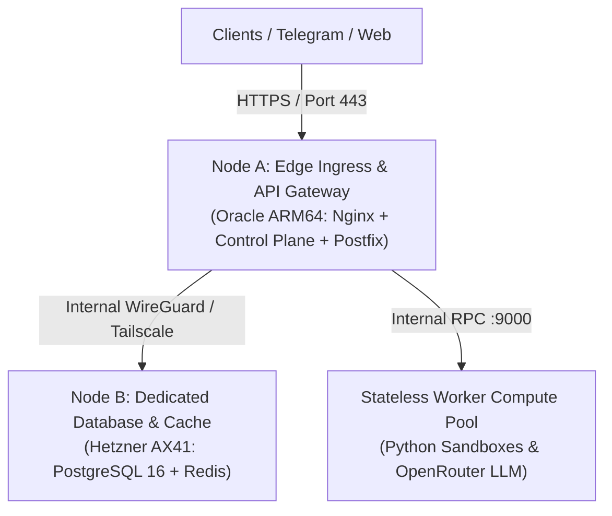

# IronClaw: Server Scaling & Compute Expansion Architecture

## 1. Capacity Tiers & Scaling Milestones

```
┌────────────────────────────────────────────────────────────────────────────────────────┐
│                              SCALING ARCHITECTURE ROADMAP                              │
├─────────────────────┬──────────────────────┬──────────────────────┬────────────────────┤
│ Milestone Tier      │ Concurrent Agents    │ Infrastructure Setup │ Monthly Host Cost  │
├─────────────────────┼──────────────────────┼──────────────────────┼────────────────────┤
│ Tier 1: Bootstrap   │ Up to 500 agents     │ Single Oracle ARM64  │ $0 - $20/mo        │
│ Tier 2: Dual-Node   │ 500 - 3,000 agents   │ App Node + DB Node   │ $60 - $120/mo      │
│ Tier 3: Multi-Node  │ 3,000 - 20,000 agents│ Nginx + 4 Worker Pods│ $250 - $500/mo     │
│ Tier 4: Global Mesh │ 20,000+ agents       │ Kubernetes + RDS     │ $1,200+/mo         │
└─────────────────────┴──────────────────────┴──────────────────────┴────────────────────┘
```

---

## 2. Tier 1 (Current State): Optimizing the Single Server

The current server (`132.226.223.180`) has **11 GB RAM** and **122 GB free NVMe SSD**, utilizing only **1.6 GB RAM** (9.3 GB free headroom).

### Optimization Steps (Instant 4x Concurrency Boost):
1. **Multi-Worker Process Pooling**:
   Instead of 1 worker process on port 9000, run **4 parallel worker processes** (ports 9000, 9001, 9002, 9003).
2. **Nginx Upstream Round-Robin Load Balancing**:
   ```nginx
   upstream worker_cluster {
       least_conn;
       server 127.0.0.1:9000 max_fails=2 fail_timeout=5s;
       server 127.0.0.1:9001 max_fails=2 fail_timeout=5s;
       server 127.0.0.1:9002 max_fails=2 fail_timeout=5s;
       server 127.0.0.1:9003 max_fails=2 fail_timeout=5s;
       keepalive 64;
   }
   ```
3. **PostgreSQL Connection Pool Tuning**:
   In `database.py`, keep `min_size=4`, `max_size=20` with statement timeouts (30s) to prevent locking.

---

## 3. Tier 2: Dual-Node Separation (App Gateway + Database)

When active subscribers exceed 500, split Database from Application Compute:



* **Node A (Ingress & Control Plane)**: Handles incoming SSL traffic, Telegram webhooks, and static web app rendering.
* **Node B (Database)**: Dedicated high-IOPS NVMe server running PostgreSQL 16 with streaming replication and Redis for asynchronous message queues.

---

## 4. Tier 3: Horizontal Stateless Worker Pool Expansion

Because worker processes are **completely stateless** (all state is stored in PostgreSQL and `/workspaces/{tenant_id}/{agent_id}`), adding compute is trivial:
1. Spin up any bare-metal or cloud VM (e.g. Hetzner Cloud CPX31 at €14/mo or Oracle ARM64).
2. Install Python 3.11 and clone `/home/opc/ironclaw/workers`.
3. Set `DATABASE_URL` and `WORKER_SHARED_SECRET` in `.env`.
4. Add the new worker node IP into Node A's Nginx `upstream worker_cluster`:
   ```nginx
   upstream worker_cluster {
       least_conn;
       server 127.0.0.1:9000;
       server 10.0.0.2:9000; # New Worker Node 2
       server 10.0.0.3:9000; # New Worker Node 3
   }
   ```

---

## 5. Automated Health Auto-Scaling Trigger

The AI Watchdog Guardian (`watchdog/guardian.py`) monitors CPU and RAM thresholds:
* If CPU > 80% for 5 continuous minutes -> Dispatches Telegram alert: `"⚠️ HIGH LOAD WARNING: Auto-scaling recommended"`.
* If a worker process fails -> Auto-restarts within 2 seconds.
