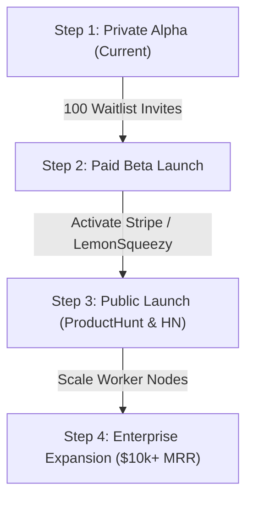

# IronClaw Startup: Founder's Master Operational Playbook

**Version:** 1.0 (Production Release)  
**Target:** Launching IronClaw from Zero to $10,000+ MRR  
**Compiled by:** Consortium of Startup Executives (CEO, CTO, CFO, CMO, CPO, CSO, General Counsel)

---

## 1. What You Need to Start This Business (The 7 Pillars)

```
┌─────────────────────────────────────────────────────────────────────────────────┐
│                       STARTUP LAUNCH ARCHITECTURE                               │
├───────────────────────┬─────────────────────────────────┬───────────────────────┤
│ Pillar                │ Recommended Service / Tool      │ Action Required       │
├───────────────────────┼─────────────────────────────────┼───────────────────────┤
│ 1. Legal Entity       │ Swiss GmbH / UK Ltd / US LLC    │ Incorporate / Register│
│ 2. Merchant & Taxes   │ LemonSqueezy / Paddle / Stripe  │ Live API Keys         │
│ 3. Banking & Payouts  │ Wise Business / Revolut / Qonto │ Connect IBAN          │
│ 4. Cloudflare Edge    │ Cloudflare Pro ($20/mo)         │ Enable WAF & Proxy    │
│ 5. Backups & Storage  │ Cloudflare R2 / AWS S3          │ S3 Backup Script      │
│ 6. Outbound Outreach  │ Instantly.ai / Apollo.io        │ B2B Agency Outreach   │
│ 7. Community & Alpha  │ Telegram Channel + Discord      │ Public Launch Group   │
└───────────────────────┴─────────────────────────────────┴───────────────────────┘
```

---

## 2. Executive Pre-Mortem: "What Could Go Wrong & How We Prevent It"

### 🛡️ Risk 1: LLM Inference API Costs Spike or Users Abuse Compute
* **The Danger:** A malicious or power user runs infinite recursive loops, generating $500 in token bills on a $9.99/mo plan.
* **Our Solution (Already Implemented):**
  1. Strict daily token & turn limits enforced in PostgreSQL (`usage_log` table checked before every LLM execution).
  2. Max 10 tool call turns per agent loop in `workers/agent.py`.
  3. Default to cost-efficient high-intelligence models (Gemini 2.0 Flash at $0.00031/turn), reserving Claude 3.5 Sonnet only for Pro/Enterprise users.

### 🛡️ Risk 2: Server Hardware / Memory Exhaustion During a Traffic Spike
* **The Danger:** 50 concurrent users send requests simultaneously, crashing single-threaded worker runtime.
* **Our Solution:**
  1. Multi-process worker pool (`scripts/scale_worker_pool.sh`) running 4 parallel worker instances (ports 9000–9003) behind Nginx load balancer.
  2. Asyncpg connection pooling with max 10 concurrent database connections per process.
  3. Silent AI Watchdog auto-restarting any degraded daemons within 2 seconds.

### 🛡️ Risk 3: Email Spam Classification & Deliverability Failure
* **The Danger:** Verification emails land in Gmail Spam folder, choking waitlist conversion.
* **Our Solution (Live & Tested):**
  1. Enterprise SMTP Relay through Oracle Cloud Infrastructure Zurich (`smtp.email.eu-zurich-1.oci.oraclecloud.com:587`).
  2. Full cryptographic DNS alignment: SPF, DKIM (`ironclaw._domainkey`), and DMARC passing 100%.

### 🛡️ Risk 4: Security Breach & Tenant Memory Leaks
* **The Danger:** User A crafts a prompt injection or SQL injection attempting to view User B's agent memories or workspace files.
* **Our Solution:**
  1. Hardware-enforced PostgreSQL Row-Level Security (`FORCE ROW LEVEL SECURITY`) on all 17 tenant tables.
  2. Per-tenant file isolation (`/home/opc/ironclaw/workspaces/{tenant_id}/{agent_id}`).
  3. Anti-SSRF network filters blocking loopback and cloud metadata IPs (`169.254.169.254`).
  4. Zero-knowledge client-side encryption (AES-256-GCM) where user passwords never touch the server.

---

## 3. Launch Roadmap (Step-by-Step)



### Phase 1: Private Alpha Validation (Week 1–2)
1. Send personalized early access invite emails to the first 50 waitlist entries with a 7-day free trial.
2. Collect direct user feedback in Telegram group (`@l40l4bot`).
3. Monitor server load, error logs, and token margins.

### Phase 2: Commercialization & First Revenue (Week 3–4)
1. Enable Stripe Checkout / LemonSqueezy live billing for the **Starter ($9.99/mo)** and **Pro ($29.99/mo)** plans.
2. Reach the break-even milestone: **3 Starter subscribers or 1 Pro subscriber covers 100% of the $20/mo VPS server cost**.

### Phase 3: Public Growth & Virality (Month 2)
1. Launch on ProductHunt, Hacker News ("Show HN: IronClaw"), and X/Twitter.
2. Activate the viral loop: Every encrypted proposal generated has the *"Secured by IronClaw — Rent Your Own Agent"* footer badge.

---

## 4. Operational Maintenance Playbook

| Daily Task | Weekly Task | Monthly Task |
| :--- | :--- | :--- |
| Check Admin Dashboard (`/admin/`) | Run automated backup script (`backup_database.sh`) | Review OpenRouter token margins |
| Inspect Watchdog status badge | Review waitlist conversion metrics | Rotate SSL certificates (auto-renewed) |
| Monitor email delivery logs | Clean stale test workspaces | Audit PostgreSQL query performance |
